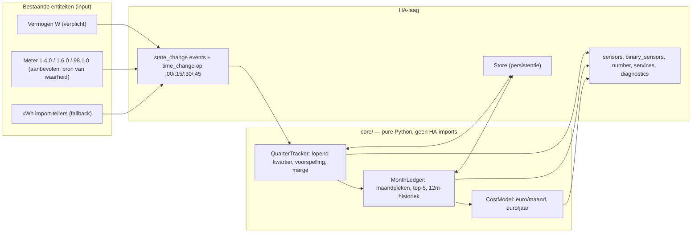

# Capaciteitstarief-integratie voor Home Assistant — voorstel v1 (meter-first)

*Status: goedgekeurd ontwerp; **M1 (rekenkern + 85 tests) is klaar**, M2 volgt. Datum: 18 augustus 2026. Herzien: meter-first i.p.v. calc-first.*

## 1. Wat het wordt, in één alinea

Een HACS-installeerbare custom integration (`custom_components/capacity_tariff`) die de Vlaamse maandpiek **bewaakt** — niet berekent. De Belgische digitale meter berekent het kwartiergemiddelde en de maandpiek zelf en stuurt die mee in het P1-telegram; die waarden nemen we als bron van waarheid over. Wat wij toevoegen is alles wat de meter niet doet: het einde van het lopende kwartier **voorspellen**, de **marge** in W tonen, twee binary sensors leveren waar automations aan hangen ("piek in gevaar" / "piek wordt gebroken"), de **kost** in € berekenen, en de 12-maandshistoriek herstart-bestendig bijhouden. Voor wie de meter-eigen sensoren niet heeft, is er een eigen kwartierberekening als fallback. De rekenkern is een losse, HA-vrije Python-module met pytest-tests; de HA-laag is een dunne wrapper.

**Waarom niet gewoon de meter-sensoren gebruiken?** Omdat de meter alleen *terugkijkt* (gemiddelde tot nu, piek tot nu). Sturen (laadpaal pauzeren, boiler uitstellen) vergt vooruitkijken: hoeveel mag ik de rest van dit kwartier nog trekken? Dat, plus kost, drempels, streefpiek en een nette entiteitenset, is de integratie.

## 2. Domeinregels waarop we bouwen

| Regel | Invulling in de integratie | Zekerheid |
|---|---|---|
| Kwartier is **klokgebonden** (:00/:15/:30/:45), gemiddeld **afgenomen** vermogen; injectie telt niet mee | Kwartiergrenzen berekend in UTC (België heeft heel-uur offset ⇒ UTC-kwartieren = lokale kwartieren, ook rond zomer/wintertijd). Vermogen wordt op ≥ 0 geklemd; bij kWh-input alleen import-registers (1.8.1 + 1.8.2) | Vast |
| De meter berekent kwartiergemiddelde en maandpiek zelf (`1-0:1.4.0`, `1-0:1.6.0`, `0-0:98.1.0`) | **Primaire bron.** Als die sensoren beschikbaar zijn nemen we ze over; onze eigen berekening loopt dan alleen mee ter controle | Vast |
| Officiële berekening is energie-gebaseerd: (kWh eind − kWh begin) × 4 | **Fallback 1** als er geen meter-sensor maar wel een kWh-import-entiteit is; **fallback 2** = tijdgewogen (zero-order-hold) integratie van het vermogen | Vast |
| Maandpiek = hoogste kwartiergemiddelde van de kalendermaand, **minimum 2,5 kW** | Kwartier hoort bij de maand waarin het *start* (23:45–00:00 telt voor de oude maand). Maandgrens in lokale tijd (HA-tijdzone) | Vast |
| Jaarkost = gemiddelde van de laatste 12 maandpieken × tarief (€/kW/jaar); ontbrekende maanden tellen als 2,5 kW | `kost_maand = max(piek, 2,5) × tarief / 12`, `kost_jaar = gem12 × tarief` | Vast, formule te toetsen aan een echte factuur |
| Tarief verschilt per netgebied en per jaar | Instelbaar in config/options, incl. of excl. BTW is aan de gebruiker; **geen** hardgecodeerde tarieventabel om te onderhouden. Default: leeg veld met hint "zie je Fluvius-factuur" — ik wil geen fout bedrag als default schrijven | Bewust open |

**Meter-first, concreet.** De Belgische digitale meter (e-MUCS) stuurt in elk P1-telegram mee: `1-0:1.4.0` = lopend kwartiergemiddelde, `1-0:1.6.0` = maandpiek met timestamp, `0-0:98.1.0` = piekhistoriek 13 maanden. De HA DSMR-integratie (Belgium-variant) en HomeWizard (BE-meters) stellen die als sensor beschikbaar. Ontwerpgevolgen:

- **Bron van waarheid.** Lopend kwartiergemiddelde en maandpiek komen van de meter als die sensoren er zijn: 0 sampling-fout, exact wat Fluvius factureert. `98.1.0` seedt de 12-maandshistoriek bij eerste installatie.
- **Eigen berekening = fallback + controle.** Wie de meter-sensoren niet heeft (oudere DSMR-configs, ESPHome-lezers, niet-BE hardware) krijgt de kWh-integratie of tijdgewogen vermogen. Wie ze wél heeft, ziet in diagnostics het verschil tussen onze berekening en de meter — dat beantwoordt op voorhand het "mijn factuur zegt iets anders"-issue.
- **De toegevoegde waarde zit vooruit:** voorspelling, marge, doelpiek, binary sensors, kost, historiek. Daarvoor is naast het gemiddelde ook het **momentane vermogen** (W) nodig — dat blijft de enige verplichte input.

Input-hiërarchie per grootheid: **meter-eigen sensor > kWh-integratie > tijdgewogen vermogen**.

## 3. Architectuur



**Event-gedreven, geen polling.** `async_track_state_change_event` op de bron-entiteiten (elke P1-update herrekent het kwartier), `async_track_time_change` op minuut 0/15/30/45 seconde 0 sluit het kwartier af. Om entiteiten HA-idiomatisch te voeden gebruik ik wél een `DataUpdateCoordinator` — maar in **push-modus** (`update_interval=None`, `async_set_updated_data`), zodat alle entiteiten `CoordinatorEntity` zijn en het fan-out-mechanisme standaard is.

**Rekenkern-API (schets):**

```python
# core/quarter.py
def quarter_bounds(now_utc: datetime) -> tuple[datetime, datetime]

class QuarterTracker:
    def on_meter_average(ts, kw) -> None       # 1.4.0: primaire bron voor het lopende gemiddelde
    def on_power(ts, watts) -> None            # extrapolatie; zero-order-hold integratie als fallback
    def on_energy(ts, kwh_import) -> None      # fallback: (kWh nu − kWh kwartierstart) × 4
    energy_wh: float; elapsed_s: float; remaining_s: float
    running_average_w: float                   # energie / verstreken tijd
    def predicted_end_w() -> float             # (energie + P_nu × resterend) / 900 s
    def margin_w(target_w) -> float            # (target × 900 − energie) / resterend — mag negatief zijn
    def is_certain_break(target_w) -> bool     # energie / 900 > target, ook bij 0 W verder
    def close() -> QuarterResult               # gemiddelde, energie, bron, kwaliteitsflag

# core/ledger.py
class MonthLedger:
    def record(QuarterResult) -> bool          # True als maandpiek steeg
    def month_peak(ym, floor_kw=2.5) -> MonthPeak   # kw, timestamp, top-5, bron (calc/meter/manual)
    def rolling_avg_12(ym, floor_kw=2.5) -> float   # ontbrekende maanden = 2,5
    def set_peak(ym, kw, ts, source="manual")       # voor de correctie-service / meter-seed

# core/cost.py
def month_cost(peak_kw, tariff) ; def year_cost(avg12_kw, tariff)
```

**Doelpiek (target).** Alle "gevaar"-logica meet tegen één *effectieve doelpiek* = `max(2,5 kW, huidige maandpiek, streefpiek)`. De streefpiek is een optionele `number`-entiteit ("Streefpiek", kW): wie zegt "ik wil deze maand onder 4 kW blijven" krijgt marge en waarschuwingen tegen 4 kW; wie niets instelt krijgt "maak het niet erger dan nu"-gedrag. Onder 2,5 kW waarschuwen we nooit — dat kost niets extra.

## 4. Entiteiten

| Entiteit | Eenheid | Betekenis |
|---|---|---|
| `sensor.kwartiervermogen_lopend` | W | Lopend kwartiergemiddelde (attribuut: resterende seconden, energie dit kwartier, bron) |
| `sensor.kwartier_voorspelling` | W | Verwacht kwartiergemiddelde bij einde: energie tot nu + huidig vermogen × resterende tijd |
| `sensor.kwartier_marge` | W | Vermogen dat je de rest van het kwartier nog constant mag trekken zonder de doelpiek te breken; negatief = al te laat. **De sensor voor automations** |
| `sensor.laatste_kwartier` | W | Gemiddelde van het laatst afgesloten kwartier (fijn voor grafieken/statistieken) |
| `sensor.maandpiek` | kW | Hoogste kwartier deze maand, min 2,5 (attributen: top-5 kwartieren, bron) |
| `sensor.maandpiek_tijdstip` | timestamp | Wanneer die piek viel |
| `sensor.doelpiek` | kW | Effectieve doelpiek waartegen marge/gevaar gemeten worden |
| `sensor.gemiddelde_piek_12m` | kW | Voortschrijdend gemiddelde van 12 maandpieken (ontbrekend = 2,5) |
| `sensor.kost_deze_maand` | € | `max(piek, 2,5) × tarief / 12` |
| `sensor.kost_jaarbasis` | € | `gem12 × tarief` |
| `binary_sensor.piek_in_gevaar` | – | Voorspelling > drempel% × doelpiek |
| `binary_sensor.piek_wordt_gebroken` | – | Wiskundig zeker: energie tot nu / 900 s > doelpiek |
| `number.streefpiek` | kW | Optioneel doel van de gebruiker (RestoreEntity) |

Services: `capacity_tariff.set_month_peak` (maand, kW, timestamp — voor correctie na desync), `capacity_tariff.reset_month`, `capacity_tariff.import_history` (lijst maand→kW, om 12 maanden te seeden vanaf een factuur of de meter). Diagnostics-download dumpt de storage-inhoud, de laatste N kwartierresultaten met hun bron, en het verschil met de meter-eigen waarden als die er zijn.

## 5. Config flow

1. **Bronnen** — entity selectors: vermogen (verplicht, `sensor` met device_class `power`); meter-eigen kwartiergemiddelde / maandpiek / historiek (**aanbevolen**, met uitleg welke DSMR/HomeWizard-sensoren dat zijn); kWh-import (fallback, 0..n `energy`-sensoren die opgeteld worden, bv. 1.8.1 + 1.8.2). Eenheden (W/kW, Wh/kWh) worden genormaliseerd op basis van `unit_of_measurement`.
2. **Parameters** — tarief €/kW/jaar, waarschuwingsdrempel % (default 90), minimumpiek kW (default 2,5, instelbaar voor de zekerheid).
3. Options flow voor alles uit stap 2 en om bronnen te wisselen. Vertalingen NL + EN.

## 6. Persistentie (Store, versie 1)

```json
{
  "months": { "2026-08": { "peak_kw": 4.12, "peak_at": "…", "top": [[4.12, "…"]], "source": "calc" } },
  "current_quarter": { "start": "…", "kwh_at_start": 12345.678, "energy_wh": 512.3, "last_ts": "…", "last_power_w": 1830 },
  "last_energy_sample": { "ts": "…", "kwh": 12346.19 }
}
```

- Altijd wegschrijven bij kwartierafsluiting en bij een nieuwe maandpiek; tussendoor `async_delay_save` (elke ~30 s) zodat het lopende kwartier bij een crash grotendeels reconstrueerbaar is.
- **Herstart middenin een kwartier:** zelfde kwartier + `kwh_at_start` bekend ⇒ exact hervatten met (kWh nu − kWh start). Alleen vermogensbron ⇒ hervatten met de opgeslagen `energy_wh` en de gap tijdgewogen aanvullen met het eerste nieuwe sample (gemarkeerd als "gereconstrueerd").
- **Herstart over meerdere kwartieren heen:** we verzinnen geen pieken. Met kWh-standen kunnen we wél de gemiddelde belasting over het gat berekenen; dat is een *ondergrens* voor de gemiste piek en verschijnt als waarschuwing/attribuut. Als een meter-eigen 1.6.0-sensor er is, nemen we die over — die heeft de waarheid.
- Historiek: 13 maanden bewaren (12 + lopende).

## 7. Randgevallen die de tests moeten dekken

- Zomer→wintertijd (kwartier 02:00–02:15 bestaat tweemaal, in UTC gewoon twee opeenvolgende kwartieren) en winter→zomertijd (kwartieren tussen 02:00 en 03:00 lokaal bestaan niet).
- Kwartier- en maandgrens: sample net vóór/na de grens ⇒ lineair interpoleren van de tellerstand op de grens (P1 elke 1 s: verwaarloosbaar, elke 10 s: telt mee).
- Onregelmatige of gemiste updates; `unavailable`/`unknown`; teller die *daalt* (vervangen meter, entity gewisseld) ⇒ sample negeren + kwartier als "onzeker" markeren.
- Netto-vermogenssensor die negatief gaat bij injectie ⇒ klemmen op 0.
- Eerste maand zonder historiek: gem12 met 11 × 2,5 kW.
- Marge negatief, `is_certain_break` exact op de grens, `remaining_s = 0`.
- Herstart in alle drie de varianten hierboven.

Kern-tests draaien puur op Python (`pytest`, geen HA); HA-laag-tests met `pytest-homeassistant-custom-component` (config flow, storage round-trip, entiteitsstaten).

## 8. Repo-indeling

```
custom_components/capacity_tariff/
  __init__.py  manifest.json  const.py  config_flow.py  coordinator.py  storage.py
  sensor.py  binary_sensor.py  number.py  services.py  services.yaml  diagnostics.py
  core/  quarter.py  ledger.py  cost.py  model.py        <- geen HA-imports
  translations/  nl.json  en.json
tests/  core/...  test_config_flow.py  test_storage.py
hacs.json  README.md  pyproject.toml  .github/workflows/  (hassfest, HACS-validatie, pytest)
```

## 9. Bouwvolgorde

| Stap | Inhoud | Resultaat |
|---|---|---|
| **M1** ✅ | `core/` + pytest: doelpiek, voorspelling, marge, ledger, kost (kritiek pad, meter-first) én de fallback-kwartierberekening met de scenario's uit §7 | Klaar: `core/{model,quarter,ledger,cost}.py`, 85 tests groen, ruff clean |
| **M2** | HA-skelet: manifest, config flow (entity selectors), coordinator in push-modus, Store + herstart-reconstructie, de sensoren uit §4 | Werkende integratie in dev-HA |
| **M3** | Binary sensors, `number.streefpiek`, services, options flow, vertalingen, diagnostics, controle eigen berekening vs. meter | Feature-compleet v1 |
| **M4** | HACS-klaar: hacs.json, README met automation-voorbeelden (laadpaal pauzeren op `kwartier_marge`), GitHub Actions | Publiceerbaar |

Buiten v1 (bewust): slimmere voorspelling met bekende lasten, integratie met energy dashboard-statistieken op maandbasis, injectie-/prosumententarief.

## 9b. Wat M1 concreet opleverde (afwijkingen t.o.v. de schets)

- **Eerlijke dekking i.p.v. hold-tot-in-het-oneindige.** Een laatst gekende waarde wordt max. 120 s "vastgehouden" (`hold_tolerance_s`). Daarna telt het kwartier als gedeeltelijk gedekt en gebruikt alleen echte metingen; de ledger negeert kwartieren met dekking < 90 % voor de piek (`min_coverage`). Liever een piek missen dan er een verzinnen — de meter-eigen `1.6.0` vangt hem toch. De HA-laag voedt op elke kwartiertick de huidige entity-states opnieuw, zodat gezonde entiteiten nooit tegen die tolerantie aanlopen.
- **Meterklok die iets vóórloopt.** Als het meter-gemiddelde in de laatste minuut plots meer dan halveert, is de meter al in zijn volgende kwartier; we houden de waarde van vóór de val als eindwaarde (`meter_rolled_early`).
- **Gap-gemiddelde als ondergrens.** Na downtime over ≥ 1 kwartier levert de eerste registerwaarde een `Gap(start, end, average_w)`; interpolatie gebeurt alleen tussen aangrenzende kwartieren.
- **Zonder vermogenssensor** (alleen kWh) wordt de staart van een kwartier met het lopende gemiddelde geëxtrapoleerd i.p.v. met 0 W.
- **Kwaliteitsvlaggen** op elk resultaat: `restored`, `energy_tail_estimated`, `tail_missing`, `counter_decrease`, `meter_stale`, `meter_rolled_early` — bedoeld voor diagnostics.

## 10. Genomen beslissingen

1. **Naam/domain:** `capacity_tariff`, titel "Capaciteitstarief (BE)".
2. **Meter-first:** meter-eigen sensoren (1.4.0/1.6.0/98.1.0) zijn de aanbevolen primaire bron; eigen berekening is fallback + controle.
3. **Streefpiek** als `number`-entiteit.
4. **Tarief-default:** leeg met hint "zie je Fluvius-factuur" — geen bedrag onderhouden.
5. **Git** lokaal geïnitialiseerd; HACS als distributiekanaal (GitHub-remote later).
6. **Minimale HA-versie:** recent 2025.x.
